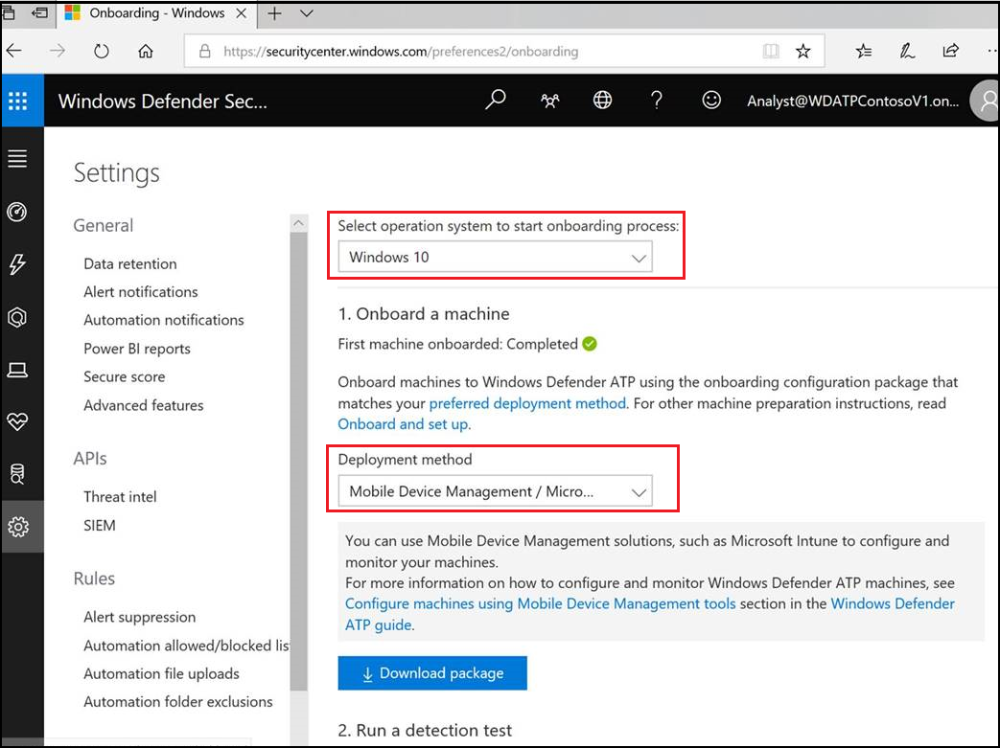

# Windows Defender Advanced Threat Protection

*Applies to: System Center Configuration Manager (Current Branch)*

Starting with version 1606 of Configuration Manager (current branch), Endpoint Protection can help manage and monitor [Windows Defender Advanced Threat Protection (ATP)](http://aka.ms/technet-wdatp). 
Windows Defender ATP helps enterprises detect, investigate, and respond to advanced attacks on their networks. 
Configuration Manager policies or Microsoft Intune can help you onboard and monitor managed devices that run Windows 10, version 1607 (build 14328) or later.

Windows Defender ATP is a service in the [Windows Security Center](https://securitycenter.windows.com). By adding and deploying a client onboarding configuration file, Configuration Manager can monitor deployment status and Windows Defender ATP agent health. Windows Defender ATP is supported on PCs running the Configuration Manager client or PCs that are managed using Mobile Device Management (MDM) such as Microsoft Intune. Intune hybrid MDM-managed computers are not supported.

 **Prerequisites**  

-   Subscription to the Windows Defender Advanced Threat Protection online service  
-   Clients computers running Windows 10, version 1607 and later  
-   Clients computers running the Configuration Manager 1610 version or later client agent or managed by MDM

## How to create an onboarding configuration file  

 1.  Logon to the [Windows Defender ATP online service](https://securitycenter.windows.com/).   

 2.  Click **Endpoint Management**.  

 3.  Select **System Center Configuration Manager (current branch) version 1606** and click **Download package**.  

 4.  Download the compressed archive (.zip) file and extract the contents.

> [!IMPORTANT]
> The Windows Defender ATP configuration file contains sensitive information which should be kept secure.

## Onboard devices for Windows Defender ATP using Microsoft Intune

1.  Logon to the [Windows Defender ATP online service](https://securitycenter.windows.com/).   

2.  Click **Settings**.  

3.  For the operating system, select **Windows 10** and for Deployment method, select **Mobile Device Management / Microsoft Intune**.  

   
 
## Onboard devices for Windows Defender ATP using Configuration Manager

1.  In the Configuration Manager console, navigate **Assets and Compliance** > **Overview** > **Endpoint Protection** > **Windows Defender ATP Policies** and click **Create Windows Defender ATP Policy**. The Windows Defender ATP Policy Wizard opens.  

2.  Type the **Name** and **Description** for the Windows Defender ATP policy and select **Onboarding**. Click **Next**.  

3.  **Browse** to the Configuration file provided by your organization’s Windows Defender ATP cloud service tenant. Click **Next**.  

4.  Specify the file samples that are collected and shared from managed devices for analysis.  

    -   **None**   

    -   **All file types**  

     Click **Next**.  

5.  Review the summary and complete the wizard.  

6.  You can now deploy the Windows Defender ATP policy to managed client computers by clicking **Deploy**.  

## Monitor Windows Defender ATP using Configuration Manager 

1.  In the Configuration Manager console, navigate **Monitoring** > **Overview** > **Security** and then click **Windows Defender ATP**.  

2.  Review the Windows Defender Advanced Threat Protection dashboard.  

    -   **Windows Defender Agent Deployment Status** – The number and percentage of eligible managed client computers with active Windows Defender ATP policy onboarded  

    -   **Windows Defender ATP Agent Health** – Percentage of computer clients reporting status for their Windows Defender ATP agent  

        -   **Healthy** - Working properly  

        -   **Inactive** - No data sent to service during time period  

        -   **Agent state** - The system service for the agent in Windows isn't running  

        -   **Not onboarded** - Policy was applied but the agent has not reported policy onboard  

## How to create and deploy an offboarding configuration file  

1.  Logon to the [Windows Defender ATP online service](https://securitycenter.windows.com/)   

2.  Click on the **Endpoint Management** menu item.  

3.  Select **System Center Configuration Manager (current branch) version 1606** and click **Endpoint offboarding**.  

4.  Download the compressed archive (.zip) file and extract the contents. Offboarding files are valid for 30 days.

5.  In the Configuration Manager console, navigate **Assets and Compliance** > **Overview** > **Endpoint Protection** > **Windows Defender ATP Policies** and click **Create Windows Defender ATP Policy**. The Windows Defender ATP Policy Wizard opens.  

6.  Type the **Name** and **Description** for the Windows Defender ATP policy and select **Offboarding**. Click **Next**.  

7.  **Browse** to the Configuration file provided by your organization’s Windows Defender ATP cloud service tenant. Click **Next**.  

8.  Review the summary and complete the wizard.  

9.  You can now deploy the Windows Defender ATP policy to managed client computers by clicking **Deploy**.  

> [!IMPORTANT]
> The Windows Defender ATP configuration files contains sensitive information which should be kept secure.

[Windows Defender Advanced Threat Protection](https://technet.microsoft.com/itpro/windows/keep-secure/windows-defender-advanced-threat-protection)

[Troubleshoot Windows Defender Advanced Threat Protection onboarding issues](https://technet.microsoft.com/itpro/windows/keep-secure/troubleshoot-onboarding-windows-defender-advanced-threat-protection)
